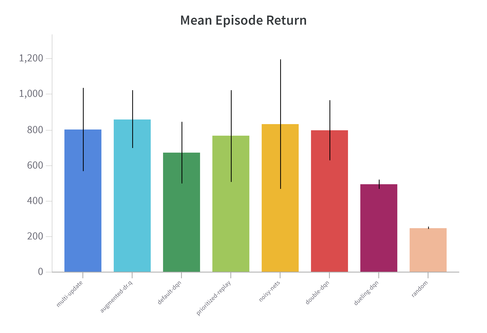

# DQN-Like Models from Pixels: Sample Efficiency Study

<p align="center">  </p> <br>

Deep RL algorithms trained directly on image pixels are notoriously not sample efficient, and this is true in particular for model-free agents like DQN and its more recent variations. Indeed, the original human-level results obtained on the Atari 2600 benchmark required 50 million training frames, which corresponds to about 38 days of game experience. More recent algorithms like Rainbow were trained for up to 200 million frames and the whole process took approximately 10 days. Requiring such an high number of interactions with the environment can have an unbearable cost in non-simulated environments - thus strongly limiting the application of RL models in real-world industrial and robotics applications.

Indeed, one of the main reasons for sample inefficiency when learning from pixels is the difficulty of training the network to appropriately encode the states and to, at the same time, predict the action values. The shallow CNN encoders which are commonly used produce a poor representation of the states, which limits performance. At the same time, naively trying to use deeper network results in clear overfitting. These problems are exacerbated by the usually sparse reward signals and by the correlation between samples, leading to algorithms that require tens of millions of interactions with the environment to converge.

During this project we tried to solve the Ms.Pacman game using different versions of the DQN value approximation algorithm while training the all for a maximum of 100k steps. In particular, we implemented a basic DQN agent as well as the following popular variations: double DQN, prioritized replay, DQN with dueling architecture and DQN with noisy networks. Finally, we also experimented with data augmentation techniques. The mean reward per episode we obtained for eacg agent is shown in the picture below, along with the performance of a random agent for comparison.

<p align="center">
  
</p>

Note that all our experiments were tracked with Weigths & Biases and can be publicly accessed [here](https://wandb.ai/mwritescode/data-efficient-rl).

## Requirements

The code has been tested with Python 3.9. <br>
In order to install the required python packages it's recommended to frist create a virtual environment then install tensorflow-gpu following the [official instructions](https://www.tensorflow.org/install/pip). Then you can simply run
```sh
  pip install -U pip
  pip install -r requirements.txt
```

## Usage
In order to train or evaluate an agent you can run
```sh
 python train.py path/to/your/config_file.yaml # for training
 python evaluate.py path/to/your/config_file.yaml # for evaluation
```
where `config_file.yaml` is a YACS configuration file following those in the [config folder](src/config/). Note that, if during training or evaluation you want to use the `WandbCallback` you need to also run `wandb login` before the commands above in order to login to your account.